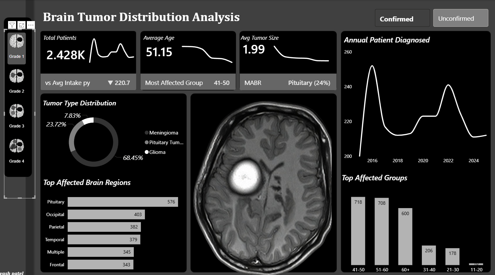

# Brain Tumor Analysis Dashboard

## 📌 Overview
This project analyzes brain tumor data to identify patterns in patient demographics, tumor characteristics, and diagnosis trends. 

The goal is not just visualization, but extracting meaningful insights that can support data-driven understanding of tumor distribution.

---

## 🛠️ Tools Used
- Power BI (Dashboard & Visualization)
- Python (In Progress – for deeper analysis)

---

## 📊 Dashboard Preview

---

## 🔍 Key Insights

- Patients in the **41–60 and 60+ age groups** show the highest number of diagnosed cases, indicating higher risk in older populations.

- **Cerebellum and Pituitary regions** are among the most frequently affected brain areas, suggesting concentration of tumor occurrence.

- **Glioma appears as the dominant tumor type**, followed by other tumor categories with lower distribution.

- Tumor size varies across categories, but **larger variations are seen within certain tumor types**, indicating heterogeneity in progression.

- Diagnosis trends across years show **fluctuations rather than steady growth**, which may reflect changes in detection, reporting, or data collection.

---

---

## 🚀 Next Steps

- Perform detailed data analysis using Python (EDA & statistical insights)
- Explore relationships between tumor type, age, and region
- Add predictive modeling for deeper understanding
- Enhance storytelling with advanced visuals

---

## 🎯 Purpose

This project demonstrates how raw healthcare data can be transformed into actionable insights using analytics and visualization tools.

## Author
Yash Patel
